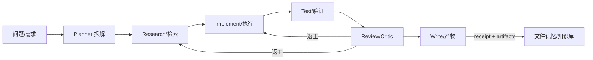

<div align="center">


# OpenClaw Research Playbook（中文）

**赛博霓虹外壳 + 学术工程内核**：面向 OpenClaw 的多智能体科研/代码工作流、轻量护栏、文件记忆优先与运维模板。

<p>
  <a href="https://docs.openclaw.ai"></a>
  
  
  <a href="./LICENSE"></a>
</p>

<p>
  <a href="#-快速开始">快速开始</a> ·
  <a href="#-最小闭环mvp">最小闭环</a> ·
  <a href="#-仓库结构">仓库结构</a> ·
  <a href="#-贡献方式">贡献</a>
</p>

</div>

---

## 📌 这是什么

这个仓库用来沉淀一套**可复用、可审计、可迭代**的 Agentic R&D 方法论，把“聊天”变成可交付的产物流水线（artifact pipeline）。

- **A 多智能体科研/代码工作流**：research → implement → test → review → write
- **B Discord 交互/控制台**：交互协议、状态机、失败回退
- **C 安全与权限（可控自动化）**：最小权限、二次确认、审计
- **Ops 运维**：更新策略、cron 可靠性、日志与排障

> 约束：本仓库**不存任何 token/账号/隐私信息**（`.env` 一律不进仓库）。

---

## ⚡ 适用场景（Use Cases）

- 📚 **选题调研 / 文献综述**：检索 → 证据包 → 摘要卡片 → 综述草稿 → 反复审稿
- 🧪 **可复现实验 / 基线复现**：环境/数据 → 可跑脚本 → 日志 → 指标对齐与偏差解释
- 🛠️ **工具/产品研发**：需求拆解 → 实现 → 测试 → Code review → 发布说明
- 🧷 **长期知识库**：以文件为中心的“可审计记忆”（daily + long-term）

---

## 🚀 快速开始

### 1) 你最该先读的三份文件

- `playbooks/file_memory.md`：文件记忆优先（daily + long-term）
- `playbooks/guardrails.md`：轻量护栏（按当前策略：不含 budget fuse）
- `templates/cron_heartbeat_shell.md`：cron/heartbeat 标准壳（含 receipt）

### 2) 本地检索（推荐装 ripgrep）

```bash
brew install ripgrep
./scripts/agent_notes_scan.sh "Redundancy"
```

### 3) 复制一份“可运行骨架”（从 examples 起步）

```bash
# 复制最小 cron 项目骨架
cp -R examples/minimal-cron-project my-cron-project

# 在新项目里按 README/模板填变量
cd my-cron-project
```

---

## ✅ 最小闭环（MVP）

把任何任务先压成一个**可跑通的最小闭环**，否则永远在“讨论”而不是“交付”。



**质量门禁（推荐默认开启）：**
- 引用/证据必须可追溯（claim → evidence）
- 能复现的命令优先（command-first）
- 无新信号退出（No-new-signal exit）

---

## 🗂️ 仓库结构

```
playbooks/      # 方法论与流程（可复制）
templates/      # 模板（可直接改成你的项目）
examples/       # 最小可运行例子（骨架工程）
scripts/        # 小工具（检索/生成receipt等）
assets/         # README 的 UI 资源
```

---

## 🧠 核心理念（A / B / C / Ops）

### A) 多智能体科研/代码工作流
- 把聊天变成 **artifact 生产线**（文件、diff、可复现命令）
- 先闭环后优化：先能跑，再变快、变稳、变好看

### B) Discord 交互/控制台
- 优先“状态机 + 协议”，UI 只是壳
- 失败回退要明确：按钮失效/工具不可用时，给替代路径

### C) 安全与权限（可控自动化）
- 最小权限
- 危险动作二次确认
- 全链路可审计（receipts / logs / artifacts）

### Ops) 运维
- 可回滚升级
- cron 稳定性（幂等、去重、退避）
- 减少重复调用（Redundancy check）

---

## 🧩 示例：可运行的 cron 工程骨架

见：`examples/minimal-cron-project/`

这个骨架强调：
- receipts（小票审计）
- 去重/缓存
- 无新信号退出

---

## 🤝 贡献方式

- 欢迎 PR：把你验证有效的 guardrail、cron 模式、复现模板沉淀进来
- 请避免提交任何密钥/个人隐私（`.env` 一律不进仓库）
